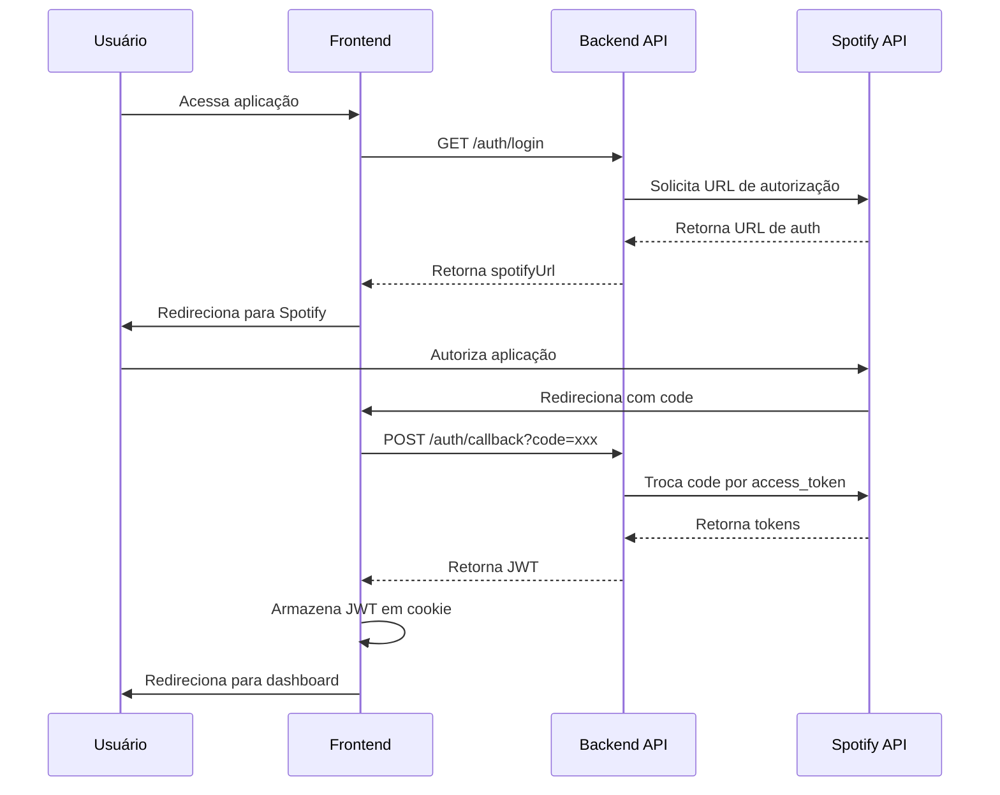
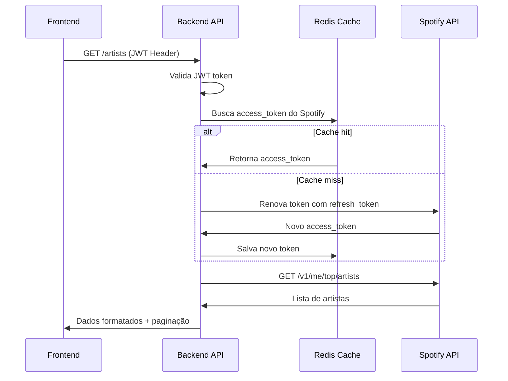

# Spotify API Frontend

Uma aplicação web moderna construída com React, TypeScript e Tailwind CSS que integra com a API do Spotify para proporcionar uma experiência completa de descoberta musical.

## Índice

- [Sobre o Projeto](#sobre-o-projeto)
- [Tecnologias Utilizadas](#tecnologias-utilizadas)
- [Funcionalidades](#funcionalidades)
- [Requisitos](#requisitos)
- [Arquitetura e Fluxo da Aplicação](#arquitetura-e-fluxo-da-aplicação)
- [Instalação e Configuração](#instalação-e-configuração)
- [Deploy com Docker](#deploy-com-docker)
- [Scripts Disponíveis](#scripts-disponíveis)
- [Estrutura do Projeto](#estrutura-do-projeto)
- [Contribuição](#contribuição)
- [Licença](#licença)

## Sobre o Projeto

Este projeto é uma aplicação frontend que oferece uma interface moderna e responsiva para interagir com a [Spotify API Backend](https://github.com/deCODEyn/spotify-API-backend). A aplicação permite aos usuários autenticar-se via Spotify, visualizar seus artistas favoritos, explorar álbuns e gerenciar playlists.

### Características Principais

- ✅ **Autenticação OAuth2** com Spotify
- ✅ **Interface Responsiva** para desktop, tablet e mobile
- ✅ **Paginação Inteligente** para melhor performance
- ✅ **Cache e Funcionamento Offline** básico com cache via redis
- ✅ **Design Moderno** inspirado no Spotify
- ✅ **TypeScript** para maior segurança de tipos
- ✅ **Arquitetura Escalável** e manutenível

## Tecnologias Utilizadas

### Frontend
- **React 19.1.1** - Biblioteca principal para interface de usuário
- **TypeScript 5.9.3** - Tipagem estática para JavaScript
- **Vite 7.1.7** - Build tool e dev server
- **Tailwind CSS 4.1.14** - Framework CSS utilitário
- **React Router DOM 7.9.4** - Roteamento client-side
- **Lucide React 0.545.0** - Biblioteca de ícones

### Ferramentas de Desenvolvimento
- **Biome 2.2.5** - Linter e formatter

### Bibliotecas de Utilitários
- **Zod 4.1.12** - Validação de schemas
- **Ky 1.12.0** - Cliente HTTP moderno
- **js-cookie 3.0.5** - Gerenciamento de cookies

### Backend Integration
- **Fastify** - Framework web rápido para Node.js
- **TypeScript** - Tipagem estática no backend
- **Redis** - Cache de sessões e tokens
- **JWT** - Autenticação stateless
- **Spotify Web API** - Integração oficial com Spotify

## Funcionalidades

### ✅ Implementadas

- [x] **Autenticação via Spotify** - OAuth2 flow completo
- [x] **Listagem de Artistas** - Top artistas do usuário
- [x] **Listagem de Álbuns** - Álbuns de artistas específicos com paginação
- [x] **Paginação** - Navegação por páginas (Anterior/Próxima)
- [x] **Gerenciamento de Playlists** - Visualização e criação de playlists
- [x] **Funcionamento Offline** - Cache básico de dados com redis
- [x] **Perfil do Usuário** - Informações e dados pessoais
- [x] **Interface Responsiva** - Responsível, adaptada a diferentes dispositivos
- [x] **Gerenciamento de Playlists** - Visualização e criação
- [x] **Perfil do Usuário** - Informações e dados pessoais
- [x] **Lint e Formatação** - Biome configurado

### 🔄 Em Desenvolvimento

- [ ] **Testes Unitários** - Jest + vitest
- [ ] **Testes E2E** - Playwright ou Cypress
- [ ] **Deploy Automatizado** - CI/CD pipeline
- [ ] **PWA Completo** - Service Workers e manifest
- [ ] **Integração Sentry** - Monitoramento de erros

### 🎁 Futuras Implementações

- [ ] **Scroll Infinito** - Alternativa à paginação tradicional
- [ ] **Integração SonarQube** - Análise de qualidade de código
- [ ] **Cache Avançado** - Service Workers para funcionamento offline
- [ ] **Notificações Push** - Para novos lançamentos
- [ ] **Modo Escuro/Claro** - Tema personalizável

## Requisitos

### Requisitos Obrigatórios

- [x] **Segmentação de commits** - Commits semânticos seguindo Conventional Commits
- [x] **Lint** - Biome configurado e funcionando
- [x] **Autenticação via Spotify** - OAuth2 flow implementado
- [x] **Listar artistas** - Interface para visualizar artistas favoritos
- [x] **Listar álbuns de um artista** - Navegação para álbuns específicos
- [x] **Utilizar paginação** - Sistema de navegação por páginas
- [x] **Integração com Backend** - Todas as funcionalidades conectadas ao backend personalizado
- [x] **Deploy da aplicação** - Docker configurado e pronto para deploy
- [ ] **Testes unitários** - Jest + React Testing Library

### Requisitos Bônus

- [ ] **Testes E2E** - Playwright ou Cypress
- [ ] **Integração com Sentry** - Monitoramento de erros
- [ ] **CI/CD** - Pipeline de integração contínua
- [ ] **Responsividade** - ✅ Implementada (mobile e tablet)
- [ ] **Qualidade de código (Sonarqube)** - Análise de qualidade
- [ ] **PWA** - Progressive Web App completo

## Arquitetura e Fluxo da Aplicação

### Arquitetura do Sistema

```
┌─────────────────┐    ┌─────────────────┐    ┌─────────────────┐
│   Frontend      │    │   Backend API   │    │   Spotify API   │
│   (React/Vite)  │◄──►│   (Fastify)     │◄──►│   (External)    │
└─────────────────┘    └─────────────────┘    └─────────────────┘
                              │
                              ▼
                       ┌─────────────────┐
                       │   Redis Cache   │
                       │   (Sessions)    │
                       └─────────────────┘
```

### Fluxo de Autenticação (Request Flow)



### Fluxo de Requisições Autenticadas



### Estrutura de Componentes

```
src/
├── components/          # Componentes reutilizáveis
│   ├── album-card.tsx   # Card de álbum
│   ├── button.tsx       # Botão customizado
│   ├── image.tsx        # Componente de imagem otimizado
│   └── sidebar/         # Barra lateral de navegação
├── context/            # Contextos React
│   └── auth-context.tsx # Gerenciamento de autenticação
├── hooks/              # Custom hooks
├── http/               # Configuração HTTP
│   └── api/           # Métodos para chamadas a API
├── layouts/            # Layouts da aplicação
│   ├── dashboard-layout.tsx
│   └── protected-route.tsx
├── pages/              # Páginas da aplicação
│   ├── albums.tsx      # Lista de álbuns
│   ├── artists.tsx     # Lista de artistas
│   ├── home.tsx        # Dashboard principal
│   ├── playlists.tsx   # Gerenciamento de playlists
│   └── profile.tsx     # Perfil do usuário
└── types/              # Definições TypeScript
    ├── auth.ts         # Tipos de autenticação
    ├── albums.ts       # Tipos de álbuns
    ├── artist.ts       # Tipos de artistas
    └── playlist.ts     # Tipos de playlists
```

### APIs Implementadas

A aplicação integra com o backend personalizado que consome a API do Spotify:

#### **Autenticação** (`src/http/api/auth.ts`)
- `getSpotifyAuthUrl()` - Obtém URL de autorização do Spotify
- `exchangeSpotifyCode()` - Troca código por token JWT
- `getMe()` - Obtém dados do usuário autenticado

#### **Artistas** (`src/http/api/artists.ts`)
- `getTopArtists()` - Lista top artistas do usuário

#### **Álbuns** (`src/http/api/albums.ts`)
- `fetchArtistAlbumsFromApi()` - Lista álbuns de um artista com paginação

#### **Playlists** (`src/http/api/playlists.ts`)
- `getUserPlaylists()` - Lista playlists do usuário
- `createPlaylist()` - Cria nova playlist

### Fluxo de Navegação

1. **Login** (`/login`) → Autenticação via Spotify
2. **Callback** (`/auth/callback`) → Processamento do token
3. **Home** (`/home`) → Dashboard principal com boas-vindas
4. **Artists** (`/artists`) → Lista de artistas favoritos
5. **Albums** (`/artists/:id/albums`) → Álbuns de um artista específico
6. **Playlists** (`/playlists`) → Gerenciamento de playlists
7. **Profile** (`/profile`) → Perfil e dados do usuário

## Instalação e Configuração

### Pré-requisitos

- **Node.js** 18+ (recomendado: 22.x)
- **npm** ou **yarn**
- **Conta Spotify** com aplicação registrada
- **Backend API** configurado e rodando ([Spotify API Backend](https://github.com/deCODEyn/spotify-API-backend))

### 1. Clone o Repositório

```bash
git clone https://github.com/deCODEyn/spotify-API-frontend.git
cd spotify-API-frontend
```

### 2. Instale as Dependências

```bash
npm install
# ou
yarn install
```

### 3. Configure as Variáveis de Ambiente

Crie um arquivo `.env.local` na raiz do projeto:

```env
VITE_API_URL=http://localhost:3333/api
```

> **Nota**: Certifique-se de que o [Spotify API Backend](https://github.com/deCODEyn/spotify-API-backend) esteja rodando na porta 3333 antes de iniciar o frontend.

### 4. Execute a Aplicação

#### Opção 1: Desenvolvimento Local

```bash
# Desenvolvimento
npm run dev

# Build para produção
npm run build

# Preview da build
npm run preview
```

A aplicação estará disponível em `http://localhost:5173`

#### Opção 2: Docker (Desenvolvimento)

Para desenvolvimento usando Docker, sem necessidade de instalar dependências localmente:

```bash
# Build e execução com Docker de desenvolvimento
docker-compose -f docker-compose-dev.yml up --build

# Execução em background
docker-compose -f docker-compose-dev.yml up -d

# Parar os serviços
docker-compose -f docker-compose-dev.yml down
```

A aplicação estará disponível em `http://localhost:5173`

#### Opção 3: Docker (Produção)

Para ambiente de produção usando Docker:

```bash
# Build e execução com Docker de produção
docker-compose up --build

# Execução em background
docker-compose up -d

# Parar os serviços
docker-compose down
```

A aplicação estará disponível em `http://localhost:8080`

> **Nota**: Para usar Docker, certifique-se de que o [Spotify API Backend](https://github.com/deCODEyn/spotify-API-backend) esteja configurado e rodando, atualize o CORS da aplicação backend para aceitar request da nova rota http://localhost:8080

## Deploy com Docker

### Docker Compose (Recomendado)

```bash
# Build e execução
docker-compose up --build

# Execução em background
docker-compose up -d

# Parar os serviços
docker-compose down
```

### Docker Manual

```bash
# Build da imagem
docker build -t spotify-frontend .

# Execução do container
docker run -p 8080:8080 spotify-frontend
```

### Variáveis de Ambiente para Produção

```env
VITE_API_URL=https://api.seudominio.com
```

## Scripts Disponíveis

```bash
# Desenvolvimento
npm run dev          # Inicia servidor de desenvolvimento

# Build e Deploy
npm run build        # Build para produção
npm run preview      # Preview da build local

# Qualidade de Código
npm run lint         # Executa Biome linter
npm run lint:fix     # Corrige problemas de lint automaticamente

# Docker
docker-compose up    # Inicia aplicação com Docker
docker-compose down  # Para aplicação Docker
```

## Estrutura do Projeto

```
spotify-API-frontend/
├── public/                 # Arquivos estáticos
├── src/                    # Código fonte
│   ├── components/         # Componentes React
│   ├── context/           # Contextos React
│   ├── hooks/             # Custom hooks
│   ├── http/              # Configuração HTTP/API
│   ├── layouts/           # Layouts da aplicação
│   ├── pages/             # Páginas da aplicação
│   ├── types/             # Definições TypeScript
│   ├── assets/            # Imagens e recursos
│   ├── app.tsx            # Componente raiz
│   └── main.tsx           # Ponto de entrada
├── docker-compose.yml     # Configuração Docker Compose
├── docker-compose-dev.yml # Docker Compose para desenvolvimento
├── Dockerfile             # Dockerfile para produção
├── Dockerfile.dev         # Dockerfile para desenvolvimento
├── nginx.conf             # Configuração Nginx
├── package.json           # Dependências e scripts
├── tsconfig.json          # Configuração TypeScript
├── vite.config.ts         # Configuração Vite
├── biome.jsonc            # Configuração Biome
└── README.md              # Documentação
```

## Configurações

### Biome (Linter/Formatter)

O projeto utiliza Biome para linting e formatação de código:

```json
{
  "linter": {
    "enabled": true,
    "rules": {
      "recommended": true
    }
  },
  "formatter": {
    "enabled": true,
    "indentStyle": "space",
    "indentWidth": 2
  }
}
```

### TypeScript

Configuração otimizada para React e Vite:

```json
{
  "compilerOptions": {
    "target": "ES2020",
    "useDefineForClassFields": true,
    "lib": ["ES2020", "DOM", "DOM.Iterable"],
    "module": "ESNext",
    "skipLibCheck": true,
    "moduleResolution": "bundler",
    "allowImportingTsExtensions": true,
    "resolveJsonModule": true,
    "isolatedModules": true,
    "noEmit": true,
    "jsx": "react-jsx",
    "strict": true,
    "noUnusedLocals": true,
    "noUnusedParameters": true,
    "noFallthroughCasesInSwitch": true
  }
}
```

##  Deploy e Produção

### Variáveis de Ambiente Necessárias

```env
# Produção
VITE_API_URL=https://api.seudominio.com
```

### Performance

- **Gzip** habilitado para compressão
- **Cache** configurado para assets estáticos
- **Otimizações** de bundle com Vite
- **Lazy loading** para imagens

## Contribuição

1. Fork o projeto
2. Crie uma branch para sua feature (`git checkout -b feature/AmazingFeature`)
3. Commit suas mudanças (`git commit -m 'Add some AmazingFeature'`)
4. Push para a branch (`git push origin feature/AmazingFeature`)
5. Abra um Pull Request

### Padrões de Commit

```
feat: adiciona nova funcionalidade/testes
fix: corrige bug
docs: atualiza documentação
style: formatação, sem mudança de código
refactor: refatoração de código
chore: mudanças em build/tooling
```

## 📄 Licença

Este projeto está sob a licença MIT. Veja o arquivo [LICENSE](LICENSE) para mais detalhes.

## Desenvolvedor

 [Maiko Defreyn](https://github.com/deCODEyn)

---

⭐ **Se este projeto foi útil para você, considere dar uma estrela!**
